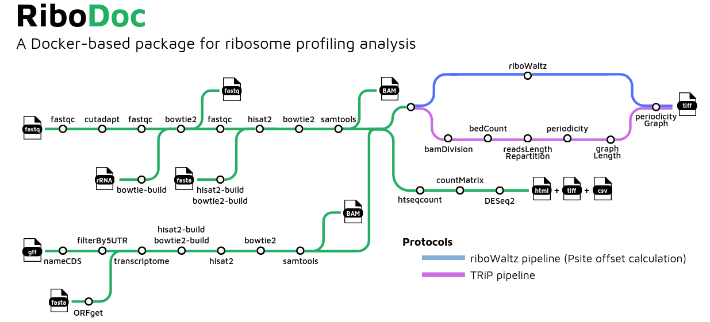
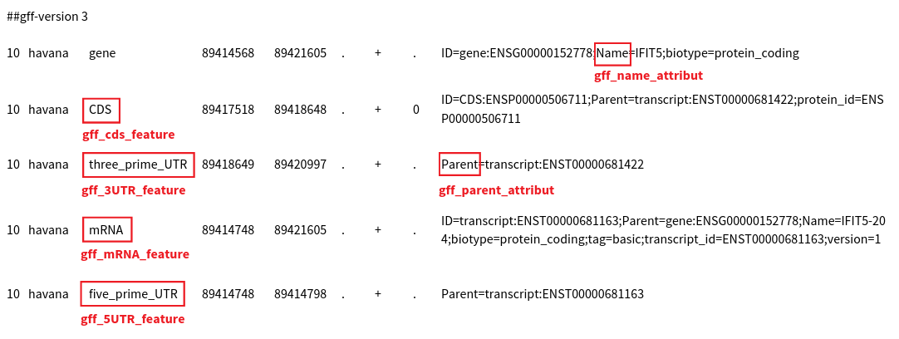
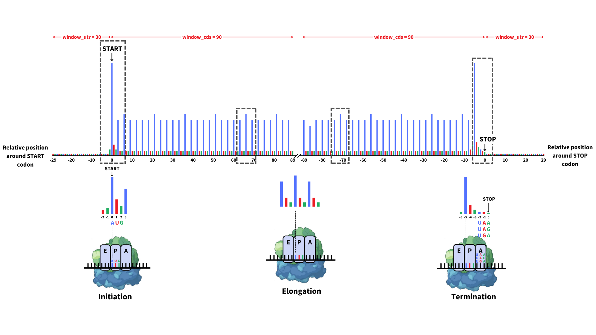

## Introduction

**RiboDoc** is a bioinformatics pipeline for Ribosome sequencing (Ribo-seq) data. It can be used to perform quality control, trimming, alignment and downstream qualitative and quantitative analysis.

It can be used with multiple operating systems, and it's goal is to standardize the general steps that must be performed systematically in Ribo-seq analysis, together with the statistical analysis and quality control of the sample. The data generated can then be exploited with more specific tools.

RiboDoc is a tool designed to standardize bioinformatics analyses in the field of translation, following the [FAIR](https://www.go-fair.org/fair-principles/) guidelines to make installation and analysis meet principles of findability, accessibility, interoperability, and reusability. Thus, this pipeline is built using [Snakemake](https://snakemake.readthedocs.io/en/stable/), a workflow management system to create reproducible and scalable data analyses. Additionally, it is a Docker-based package, which means it can be used by anyone. [Docker](https://www.docker.com/) is a container which packages up code and all its dependencies so RiboDoc can run quickly and reliably from one computing environment to another. 

If you want to easily understand how to launch RiboDoc on your own computer, you can check our video tutorial just here :

## Pipeline summary

RiboDoc is designed to perform all classical steps of **ribosome profiling** (RiboSeq) data analysis from the FastQ files to the differential expression analysis with necessary quality controls.

1. Quality Control of raw reads with [`FastQC`](https://www.bioinformatics.babraham.ac.uk/projects/fastqc/)
2. Adapter and quality trimming, read length filtering with [`Cutadapt`](https://cutadapt.readthedocs.io/en/stable/)
3. Quality Control of trimmed reads with [`FastQC`](https://www.bioinformatics.babraham.ac.uk/projects/fastqc/)
4. Removal of contaminants RNA (rRNA, tRNA, viral RNA, ...) with [`Bowtie2`](https://bowtie-bio.sourceforge.net/bowtie2/index.shtml)
5. Quality Control of depleted reads with [`FastQC`](https://www.bioinformatics.babraham.ac.uk/projects/fastqc/)
6. Genome and transcriptome alignment of reads conjointly with [`Hisat2`](http://daehwankimlab.github.io/hisat2/) and [`Bowtie2`](https://bowtie-bio.sourceforge.net/bowtie2/index.shtml)
7. Sort and index alignments with [`samtools`](https://sourceforge.net/projects/samtools/files/samtools/)
8. Reads Count with [`htseq-count`](https://htseq.readthedocs.io/en/release_0.11.1/count.html#)
9.Analysis of differential gene expression with ['DESeq2'](https://genomebiology.biomedcentral.com/articles/10.1186/s13059-014-0550-8)
10. Offset prediction and periodicity graph creation with [`ribowaltz`](https://journals.plos.org/ploscompbiol/article?id=10.1371/journal.pcbi.1006169) or `TRiP`

## Configuration and data preparation

1. Ensure [`Docker`](https://docs.docker.com/engine/install/) or [`Singularity`](https://docs.sylabs.io/guides/3.5/user-guide/introduction.html) are installed on your system. If you don't have super user rights (if your work on a cluster for example), Singularity might be prefered as it does not required it.

2. A precise architecture in your project folder is required. The first step is the project folder creation. It is named as your project and will be the volume linked to the container. Then, two sub-folders and a file have to be created and filled.
 
>**Caution, those steps are majors for the good course of the analysis.**
>**The subfolders names do not have uppercase letters.**

a. Create the first subfolder and name it `fastq`. This subfolder, as its name suggests, should contain your FastQ files compressed in gzip format (`*.gz*`). 

>**Format of file names must be as following:** `[CONDITION]_[NAME].[REPLICATE].fastq.gz`

For example, a replicate of the wild-type condition the sample could be named `Wild_Type.56.fastq.gz` and the name of a replicate for the mutant samples could be `Mutant.42.fastq.gz`.

>**Please avoid having dashes "-", parentheses "(" and/or ")", blank spaces and more generally any special characters except underscores "_" in file names**

>Caution, for **Windows**, extensions can be hidden.

If you want to try RiboDoc on an example dataset, you can find one on GEO : [GEO GSE173856](https://www.ncbi.nlm.nih.gov/geo/query/acc.cgi?acc=GSE173856). If you do so, be aware that this dataset does not align enough material for a use of the riboWaltz pipeline and TRiP should be selected (see later for details).

b. Create the second subfolder and name it `database`. In this subfolder, you must put at least the following three files:
* A FASTA format annotation file corresponding to the reference genome. We advise you to download it from the [Ensembl](https://www.ensembl.org/index.html) database, as the files are maintained up to date and following the standard GFF format.

For example, for an entire yeast genome, you can look for [S. cerevisiae genome](http://www.ensembl.org/Saccharomyces_cerevisiae/Info/Index), then click on "*Download DNA sequence (FASTA)*" and download the `Saccharomyces_cerevisiae.R64-1-1.dna.toplevel.fa.gz` file in the genome assembly list of fasta files, decompress it and place it in the `database` subfolder of your project directory.

* A GFF format annotation file corresponding to the reference genome.

For example, for the yeast genome annotations, you can look for [S. cerevisiae genome](http://www.ensembl.org/Saccharomyces_cerevisiae/Info/Index), then click on "*Download GFF3*" and download the `Saccharomyces_cerevisiae.R64-1-1.110.gff3` file (the '110' part would change depending on the version of annotation) in the genome annotation list of gff files, unzip it and place it in the `database` subfolder of your project directory.

* A fasta format file of unwanted sequences. This file must gather together DNA sequences you want to remove from the analysis. As a rule, these are at least ribosomal RNA sequences (rRNA). You can also add mitochondrial DNA, non-chromosomal DNA or any other fasta sequence of your choice which you want to be discarded in the analysis. You can generate the fasta files associated to the orgnanism rRNAs from the [Silva](https://www.arb-silva.de) database for example. You could also find your desired sequences in the database from [NCBI website](https://www.ncbi.nlm.nih.gov/) or design them yourself. It is up to you. If you want to remove some specific sequences, you just have to create a file with, for each sequence, one line starting with a ">" where you can add a name for your sequence followed by one line containing the sequence to remove. It gives you this format :
>&emsp; >Sequence_X
>&emsp; GCTGACACGCTGTCCTCTGGCGACCTGTCGTCGGAGAGGTTGGGCCTCCGGATGCGCGCGGGGCTCTGGCCTCACGGTGACCGGCTAGCCGGCCGCGCTCCTGCCTTGAGCCGCCTGCCGCGGCCCGCGGGCCTGCTGTT
>&emsp; >Sequence_Y
>&emsp; CTCTCGCGCGTCCGAGCGTCCCGACTCCCGGTGCCGGCCCGGGTCCGGGTCTCTGACCCACCCGGGGGCG

>If you do not want to remove any sequence, just leave the outRNA parameter of the configuration file empty (`fasta_outRNA: ""`).

Folder architecture example at this step:
Project_name
├── fastq 
│&emsp;&emsp;├── Wild_Type.1.fastq.gz 
│&emsp;&emsp;├── Wild_Type.2.fastq.gz 
│&emsp;&emsp;├── Mutant.1.fastq.gz 
│&emsp;&emsp;└── Mutant.2.fastq.gz
└── database 
&emsp;&emsp;&emsp;├── reference_genome_sequences.fa
&emsp;&emsp;&emsp;├── reference_genome_annotations.gff3
&emsp;&emsp;&emsp;└── RNA_to_remove.fa

c. Create a configuration file `config.yaml`. It contains some parameters about your data, how you want to process it and which RiboDoc analysis you want to perform. You must download it [here](https://raw.githubusercontent.com/equipeGST/RiboDoc/main/config.yaml) and open it with a text editor as a text file. It must be carefully completed and be present in the project directory everytime you want to run RiboDoc. A copy of this file will be made in the `RESULTS/` folder to keep a trace of the parameters you chose for your last analysis for reproductibility. 

>Caution
>&emsp;&emsp;&emsp;Spaces and quotation marks **must not be changed** ! Your information must be entered between quotes and should NOT have spaces 

## Pipeline parameters

All pipeline parameters are specified in the configuration file `config.yaml`. Some parameters are filled by default, some are mandatory and others optional.

### Project name
First and easy step, the project name. You can use the same as your folder. For example : 
>`project_name: yYeastrRibsSeq"` 

### Name of database files
You must enter the full name, **with extensions** and **without the path**, of files added in the `database` subfolder previously created. For example :
>`fasta: "Saccharomyces_cerevisiae.R64-1-1.dna.toplevel.fa"`
>`gff: "Saccharomyces_cerevisiae.R64-1-1.110.gff3"`
>`fasta_outRNA: "Saccharomyces_cerevisiae_rRNA.fa"` (can be left empty) 

### Trimming information
During RiboDoc process, reads/RPF are trimmed and selected depending on their length. If your data contains reads already trimmed of their adapter, you can set `already_trimmed` option on `“yes”`. Otherwise, set it on `"no"`.If they are **not trimmed**, you should specify the **sequence of the adapter** between quotes. If you do not put anything between the quotes, RiboDoc will try to find the adapter itself. When this parameter is left empty, be careful and check on what is written in the `RESULTS/adapter_lists/` files. For example :
>`already_trimmed: "no"` 
>`adapt_sequence: "AGATCGGAAGAGCACACGTCTGAACTCCAGTCA"`

### RPF lengths selection
You also have to define the range for read length selection. Default values select reads from 25 to 35 nucleotides long as RPF are usually around 30 nucleotides long. For example : 
>`readsLength_min: "25"`
>`readsLength_max: "35"` 

### Annotations vocabulary
You might also need to specify features keywords in the GFF file to fit your GFF file format. You need to specified which feature defined a CDS/ORF in your annotation file (`gff_cds_feature`), same for mRNA/transcript (`gff_mRNA_feature`), 5'UTR (`gff_5UTR_feature`) and 3'UTR (`gff_3UTR_feature`). It is also important to specify which attribute to use to regroups reads during counting (`gff_parent_attribut`, default is `"Parent"` for Parent of the CDS features) and what is the name of the genes features in the GFF (`gff_name_attribut`, default is `"Name"`). For example :
>`gff_cds_feature: "CDS"`
>`gff_mRNA_feature: "mRNA"` 
>`gff_5UTR_feature: "five_prime_UTR"`
>`gff_3UTR_feature: "three_prime_UTR"`
>`gff_parent_attribut: "Parent"`
>`gff_name_attribut: "Name"`

### Differential analysis
To be able to perform statistical analyses, you must define your reference condition and your comparing condition(s) as well as your **thresholds**. A `reference_condition` corresponds to the `[CONDITION]` in your FastQ file names, like `"Wild_Type"` (as in `Wild_Type.1.fastq.gz`). You also need to fill in the `conditions` parameter. It can be a single comparative condition (like `"Mutant"`) or multiple ones (if so, they must be separated by a comma like `"Mutant_XY,Mutant_XZ"`). As regards thresholds, we use a p-value threshold (`p-val`) to define which cutoff is applied to reject the null hypothesis and state that there is evidence against the null (i.e. the gene is differentially expressed). We also use a log2FoldChange threshold (`logFC`) that selects only genes or transcripts with a sufficient expression ratio between the comparison and control groups.
>`reference_condition: "Wild_Type"`
>`conditions: "Mutant"`
>`p-val: "0.01"`
>`logFC: "0"` 

### Qualitative analysis
During the qualitative analysis, a nucleotide periodicity is displayed as a metagene profile (or metaprofile). It provides the amount of footprints on relative coordinates around annotated start and stop codons. Two pipelines dedicated to qualitative analysis are available in RiboDoc. The first one uses the [`riboWaltz tool`](https://github.com/LabTranslationalArchitectomics/riboWaltz) which can need high RAM resources depending on your input data volume and reference organism. The second pipeline is a series of scripts called `TRiP`. riboWaltz calculates a P-site offset (length from the beginning of the read to the first base of its P-site) for each length of RPF. It allows a more precise determination of the ribosome decoding sites coordinates and more accurate metaprofiles whereas TRiP makes the metaprofiles with the coordinates of the first nucleotide of the reads (5' end), which do not really correspond to the codons decoded by the ribosome. Choose between the 2 qualitative analysis pipelines. Default is `"ribowaltz"`. You need to specify a number of bases before the start and after the stop for periodicity graph generation. The window selected by default is -30/+90 nucleotides and -90/+30 nucleotides around start and stop codons respectively. 
>`qualitative_analysis: "ribowaltz"`
>`window_utr: "30"`
>`window_cds: "90"`

### UTR covering option
Those parameters are only required if you want to count reads which align on UTR regions, which is not perform by default. In this case, change the default value of `UTR` to `"yes"`, otherwise it is set to `"no"`.
>`UTR: "no"`
>`gff_3UTR_feature: "three_prime_UTR"`

### Codon Occupancy
RiboDoc also allows users to perform codon occupancy analysis. This analysis computes the frequency with which ribosomes translate a particular codon within a gene. It provides insights into the translation dynamics of mRNA and allows the identification of pauses or stalling during translation. Codon occupancy analysis is optional but if you want to launch it, specify `"yes"` to `"codon_occupancy"` option and precise which ribosomal decoding site (`site`) you want to analyze (`"A"` or `"P"`).
>`codon_occupancy: "yes"`
>`site: "P"`

## Quick start

1. Ensure Singularity or Docker is installed on your system.
2. Pull RiboDoc image. If you never used RiboDoc on your workstation, you must pull the image from Docker Hub, either with Docker or Singularity. You can name the image as you want but the extension should be *.sif*.
>Singularity: `singularity pull /path/to/your/singularity/image.sif docker://equipegst/ribodoc` 

>Docker: `docker pull equipegst/ribodoc`
If you have any error, it might come from a rights/permission problem as Docker needs administrator privilegies to work.

3. Prepare your data files and fill in the configuration file.
4. Launch RiboDoc. Now that your folder's architecture is ready and the image is on your computer, you can run RiboDoc with one of the following command:

>Singularity: `singularity run --bind /path/to/your/project/folder/:/data/ /path/to/your/singularity/image.sif CPU_NUMBER MEMORY_AMOUNT`

>Docker: `docker run --rm -v /path/to/your/project/folder/:/data/ equipegst/ribodoc CPU_NUMBER MEMORY_AMOUNT`

- `/path/to/your/project/folder/` is the **full path** of the directory with all the files you prepared for the analysis.
>The path to your project folder and the "/data/" path must start and finish with a slash "/". For Windows users, it has to start at the local disks C or D: C:\your\path\ and has to be composed and finished with backslashes "\". 

- `/path/to/your/singularity/image.sif` is the path leading to the previously pulled singularity image of RiboDoc. If you use Docker instead, you can directly put `equipegst/ribodoc` for using the latest image of RiboDoc container or you can also specify a peculiar version, like `equipegst/ribodoc:v0.8.1`.
- `:/data/` corresponds to the path of the project directory, inside the container. **It must not be modified in any way.**
- `CPU_NUMBER` is the total number of threads you want to use for your analysis (Ex : 4).
- `MEMORY_AMOUNT` is the maximum amount of memory in Gigabytes (RAM) you want to use for your analysis (Ex : 30). 
>Be careful to have enough memory available for alignment steps or the pipeline will be stopped. If the pipeline crashes without easily findable error, try lowering this value to enable less jobs at the same time.

- You can also add the `--disable-cache` option with singularity in order to delete singularity image and cache after the run is done.

Command line example :

> Docker : `docker run --rm -v /home/user.nameyyeastrribsseq/:/data/ equipegst/ribodoc 40 60`

> Singularity: `singularity run --bind /home/user.nameyyeastrribsseq/:/data/ /home/user.name/ribodoc_v0.9.0.32.sif 40 60`

## In case of any error 
Managed by Snakemake, the pipeline will finish all jobs unrelated to the rule/job that failed before exiting. If you use Docker, you should let it finish to be sure to avoid any error in future runs but you can still force the container to stop with Docker Desktop or with the following command lines :

>`docker container ls` Which provides you the container's ID (For example : `9989909f047d`)  
>`docker stop [ID]` Where `[ID]` is the id obtained with the previous command  
> If you have issues with the use of Docker, you must refer to their [website](https://docs.docker.com/). 

On the other hand, Singularity allows you to end the job by pressing `Ctrl` + `C` **once** and Snakemake will delete all files which might be corrupted before stopping. If you press it again, this might lead to an error in future runs.

If the error happens using RiboDoc, the rule (job) which failed is indicated in your terminal. You can then find the error outputs in the `logs` folder. Each rule has a precise name and a folder related to it with files corresponding to the different steps of this rule.

A problem could also occur due to insufficient provided memory. In this case, it will not display a specific error message. It usually happens during the index building, the alignments or the riboWaltz tool script, as they are the steps asking for more resources in RiboDoc pipeline. Try resuming it with more memory available if you are on a cluster or reduce the `MEMORY_AMOUNT` in your launch command to reduce potential multi-threading.

>If you can not solve the problem by yourself, you can contact us through the [issues](https://github.com/equipeGST/RiboDoc/issues) page of our GitHub or by mail. We will be happy to provide all the help we can.  
>The easiest way for us to help you is to you send us an archive containing your `config.yaml` file, `logs/` folder and `stats/` folder.

## Pipeline outputs

The pipeline outputs results in a number of folders. Here is the example folder architecture after a RiboDoc run.  
**yeast_riboseq**  
├── **fastq**  
│&emsp;&emsp;├── *Wild_Type.1.fastq.gz*   
│&emsp;&emsp;├── *Wild_Type.2.fastq.gz*   
│&emsp;&emsp;├── *Mutant.1.fastq.gz*   
│&emsp;&emsp;└── *Mutant.2.fastq.gz*  
├── **database**  
│&emsp;&emsp;├── *Saccharomyces_cerevisiae.R64-1-1.dna.toplevel.fa*  
│&emsp;&emsp;├── *Saccharomyces_cerevisiae.R64-1-1.110.gff3*  
│&emsp;&emsp;└── *Saccharomyces_cerevisiae_rRNA.fa*  
├── *config.yaml*  
├── **logs**  
├── **stats**  
├── **MAIN_RESULTS**  
├── **RESULTS**  
│&emsp;&emsp;├── *config.yaml*  
│&emsp;&emsp;├── *Yeast_RiboSeq.Analysis_Report.25-35.txt*  
│&emsp;&emsp;├── *Yeast_RiboSeq.Analysis_Table_summary.25-35.csv*  
│&emsp;&emsp;├── **adapter_lists**  
│&emsp;&emsp;│&emsp;&emsp;├── *Wild_Type.1.txt*  
│&emsp;&emsp;│&emsp;&emsp;├── *Wild_Type.2.txt*  
│&emsp;&emsp;│&emsp;&emsp;├── *Mutant.1.txt*  
│&emsp;&emsp;│&emsp;&emsp;└── *Mutant.2.txt*  
│&emsp;&emsp;├── **annex_database**  
│&emsp;&emsp;│&emsp;&emsp;├── *gff_features_counts.txt*  
│&emsp;&emsp;│&emsp;&emsp;├── *NamedCDS_genomic_gff_files.gff*  
│&emsp;&emsp;│&emsp;&emsp;├── *transcriptome_elongated.nfasta*  
│&emsp;&emsp;│&emsp;&emsp;├── *transcriptome_elongated.gff*  
│&emsp;&emsp;│&emsp;&emsp;├── *transcriptome_elongated.exons_gtf_file_for_riboWaltz.gtf*  
│&emsp;&emsp;│&emsp;&emsp;├── *transcriptome_elongated.exons_Saccharomyces_cerevisiae.R64-1-1.dna.toplevel.fa*  
│&emsp;&emsp;│&emsp;&emsp;└── **index_files**  
│&emsp;&emsp;├── **BAM.25-35**  
│&emsp;&emsp;│&emsp;&emsp;├── *Wild_Type.1.25-35.bam*  
│&emsp;&emsp;│&emsp;&emsp;├── *Wild_Type.1.25-35.bai*  
│&emsp;&emsp;│&emsp;&emsp;├── *Wild_Type.2.25-35.bam*  
│&emsp;&emsp;│&emsp;&emsp;├── *Wild_Type.2.25-35.bai*  
│&emsp;&emsp;│&emsp;&emsp;├── *Mutant.1.25-35.bam*  
│&emsp;&emsp;│&emsp;&emsp;├── *Mutant.1.25-35.bai*  
│&emsp;&emsp;│&emsp;&emsp;├── *Mutant.2.25-35.bam*  
│&emsp;&emsp;│&emsp;&emsp;└── *Mutant.2.25-35.bai*  
│&emsp;&emsp;├── **BAM_transcriptome.25-35**  
│&emsp;&emsp;│&emsp;&emsp;├── *transcriptome_elongated.Wild_Type.1.25-35.bam*  
│&emsp;&emsp;│&emsp;&emsp;├── *transcriptome_elongated.Wild_Type.1.25-35.bai*  
│&emsp;&emsp;│&emsp;&emsp;├── *transcriptome_elongated.Wild_Type.2.25-35.bam*  
│&emsp;&emsp;│&emsp;&emsp;├── *transcriptome_elongated.Wild_Type.2.25-35.bai*  
│&emsp;&emsp;│&emsp;&emsp;├── *transcriptome_elongated.Mutant.1.25-35.bam*  
│&emsp;&emsp;│&emsp;&emsp;├── *transcriptome_elongated.Mutant.1.25-35.bai*  
│&emsp;&emsp;│&emsp;&emsp;├── *transcriptome_elongated.Mutant.2.25-35.bam*  
│&emsp;&emsp;│&emsp;&emsp;└── *transcriptome_elongated.Mutant.2.25-35.bai*  
│&emsp;&emsp;├── **DESeq2_CDS.25-35**  
│&emsp;&emsp;│&emsp;&emsp;├── *count_matrix_by_transcript_IDs.csv*  
│&emsp;&emsp;│&emsp;&emsp;├── *names_correspondence_list.csv*  
│&emsp;&emsp;│&emsp;&emsp;├── **DESeq2_by_gene**  
│&emsp;&emsp;│&emsp;&emsp;└── **DESeq2_by_transcript**  
│&emsp;&emsp;├── **fastqc**  
│&emsp;&emsp;│&emsp;&emsp;├── **fastqc_before_trimming**  
│&emsp;&emsp;│&emsp;&emsp;└── **fastqc_after_trimming**  
│&emsp;&emsp;├── **HTSeq-counts**  
│&emsp;&emsp;│&emsp;&emsp;└── **htseqcount_CDS**  
│&emsp;&emsp;├── **periodicity_-30+90**  
│&emsp;&emsp;│&emsp;&emsp;├── **transcriptome_elongated.Wild_Type.1**  
│&emsp;&emsp;│&emsp;&emsp;│&emsp;&emsp;├── *length25_start.tiff*  
│&emsp;&emsp;│&emsp;&emsp;│&emsp;&emsp;├── *length25_stop.tiff*  
│&emsp;&emsp;│&emsp;&emsp;│&emsp;&emsp;├── ...  
│&emsp;&emsp;│&emsp;&emsp;│&emsp;&emsp;├── *length35_start.tiff*  
│&emsp;&emsp;│&emsp;&emsp;│&emsp;&emsp;└── *length35_stop.tiff*  
│&emsp;&emsp;│&emsp;&emsp;├── **transcriptome_elongated.Wild_Type.2**  
│&emsp;&emsp;│&emsp;&emsp;├── **transcriptome_elongated.Mutant.1**  
│&emsp;&emsp;│&emsp;&emsp;└── **transcriptome_elongated.Mutant.2**  
│&emsp;&emsp;└── **riboWaltz.25-35**  
├── *dag_all.svg*  
└── *dag_last_run.svg*  

### Files

- The `MAIN_RESULTS` folder contains a copy of the most interesting files present in the `RESULTS` folder.
- The `RESULTS` folder contains these subfolders:  
    - `adapter_lists`: contains text files with adapters list for each sample that were found in the `config.yaml` file or determined from data is the user did not provide any adapter sequence.  
    - `annex_database`: contains the indexes for the alignments, the re-formatted FASTA and GFF files for the analysis and the GTF file for the riboWaltz pipeline.
    - `BAM.25-35`: contains a BAM format alignment file (`*.bam`) for each sample.  
    - `BAM_transcriptome.25-35`: contains a BAM file for each sample generated from the transcriptome GTF and FASTA files generated for riboWaltz.  
    - `DESeq2_CDS.25-35`: contains the differential analysis html report (`Yeast_RiboSeq.Final_report.html`), the count matrices, the tables and the images related to the differential analysis, regrouped by gene or by transcript.  
    - `fastqc`: contains data quality controls FastQC reports of pre-processed and trimmed read.
    - `HTSeq-counts`: contains HTseq output for CDS counts (and UTR regions if selected in the `config.yaml` file).
    - `qualitativeAnalysis` or `riboWaltz.25-35` and `periodicity_-30+90`: they contain all files related to qualitative test like metaprofiles and reads lengths repartition.
It contains also three files:  
    - `Yeast_RiboSeq.Analysis_Report.25-35.txt` gathers standard output of each analysis main tool. It allows to know numbers of reads at each step of the analysis.  
    - `Yeast_RiboSeq.Analysis_Table_summary.25-35.csv` summarizes the same standard outputs as previous file in a table.  
    - `config.yaml` is a copy of `config.yaml` file at the root of your project for reproductability.  
- `logs` folder groups together all the standard errors messages from tools used in RiboDoc pipeline. Thus, in the event of an error, it allows you to identify the problematic step.  
- `stats` groups all main statistics which the `Analysis_Report` and `Analysis_Table_summary` files are made from.  
- `dag_all.svg` file is a graphical representation of all jobs where the edges represent dependencies.  

> In case a sample is too variable against other replicates or if new sequenced samples are to be added to your study, you can delete/move or add them in the `fastq` subfolder. RiboDoc will only process necessary steps based on the fastq files list.

> Containers state saves and cache can take more and more space if you do not use the `--rm` option for docker. To clean everything related to containers, just right in your terminal : `docker system prune -af`

## Citations

If you use RiboDoc for your analysis, please cite it using the following doi: [10.1016/j.csbj.2021.05.014](https://doi.org/10.1016/j.csbj.2021.05.014).

An extensive list of references for the tools used by the pipeline can be found in the [`CITATIONS.md`](CITATIONS.md) file.
